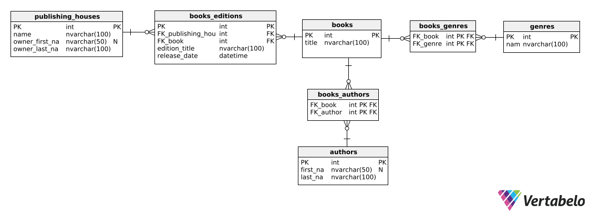

­

# Kolokwium 1 - Grupa A

Czas: 1h25m

**Rozwiąż poniższe zadania.**

1. Utwórz prywatne repozytorium na platformie GitHub i udostępnij je prowadzącemu zajęcia. W repozytorium należy umieścić rozwiązanie zadania **2** po jego ukończeniu.
2. Utwórz webapi w technologii .NET, które będzie spełniało poniższe założenia:

   - API będzie operować na poniższej bazie danych, zawierającej dane na temat książek oraz ich wydań.
     

   - Umożliwi wysyłanie zapytań http pod końcówkę **api/books/{id}/genres**, za pomocą której będzie można zobaczyć gatunki, które są przypisane do danej książki.
     Przykładowe zapytanie:

     ```
     Request
     GET api/books/1/genres

     Response
     200
     {
         id: 1,
         title: "The Hobbit"
         genres: [
             "High Fantasy",
             "Classic",
             "Adventure",
             "Fiction"
         ]
     }
     ```

   - Umożliwi wysyłanie zapytań http pod końcówkę **api/books**, za pomocą której będzie można dodać do bazy nową książkę oraz przypisać do niej gatunki.
     Przykładowe zapytanie:

     ```
     Request
     POST api/books
     {
        title: "The Hobbit",
        genres: [
           1,
           2,
           3
        ]
     }

     Response
     201
     api/books/1/genres
     {
           id: 1,
           title: "The Hobbit"
           genres: [
               "High Fantasy",
               "Classic",
               "Adventure",
           ]
     }
     ```

## Pamiętaj o:

- Zwracaniu odpowiednich kodów http;
- Walidowaniu zapytań (jeżeli jest to wskazane);
- Programowaniu w sposób asynchroniczny;
- Utrzymywaniu porządku w kodzie;
- Wydzieleniu logiki bazodanowej do oddzielnej warstwy (repozytoria / serwis);
- Utworzeniu poprawnego pliku .gitignore przed dodaniem plików do repozytorium;
- Czasie!!!

## Ocenianie

Punktem wyjścia jest 100%. Za błędy w pracy odejmowana jest konkretna ilość punktów:

- -5% za każdy nieodpowiedni / niepoprawnie użyty kod http (max -15%);
- -45% za każdą brakującą końcówkę (max -90%);
- -10% za brak wydzielenia logiki bazodanowej do oddzielnej warstwy;
- programowanie w sposób synchroniczny (max -10%);
- brak walidacji (max -10%);
- nieczytelny kod (max -10%);
- -10% za zbędne pliki w repozytorium;
- -25% za ręczne zuploadowanie projektu do repozytorium;
- -5% za każdy niepoprawny adres końcówki.
